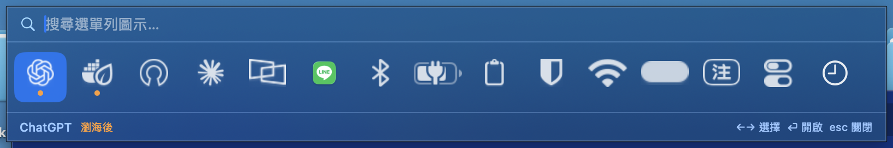
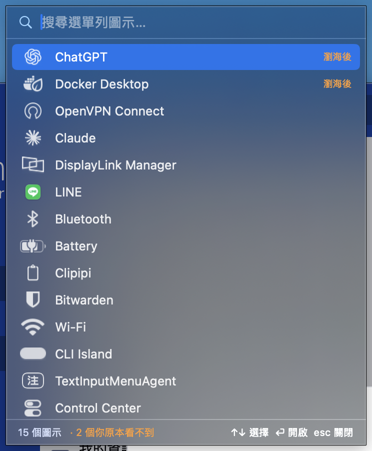
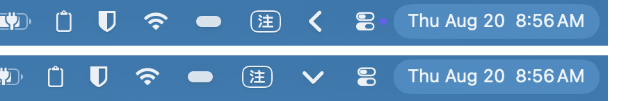

# MenuBaba

macOS 選單列圖示的搜尋面板。按一個熱鍵，看到**全部**的選單列圖示 —— 包含被瀏海遮住、
或因為擠不下而被系統藏起來的那些 —— 打字過濾，按 Enter 直接觸發。



## 為什麼需要這個東西

14 吋 MacBook Pro 的瀏海佔掉選單列中間 185 個點（實測 `x = 663 ~ 848`）。
瀏海右側的可用區只剩 664 點，但選單列 app 一多，圖示的總寬度很快就會超過。

超過之後 macOS 的處理方式是：**把放不下的直接不畫，而且不提供任何介面叫出來**。
它們還在、還在運作、Accessibility 也列得到，就是你看不見也點不到。

MenuBaba 就是那個缺掉的介面。

## 功能

- **列出全部圖示**，被瀏海遮住或被推出畫面的會特別標記
- **顯示選單列上的原圖示**，不是 app 圖示 —— 用 ScreenCaptureKit 截取圖示自己的視窗
- **搜尋**：打 app 名稱或圖示名稱都找得到
- **點擊或 Enter 直接觸發**，就跟你在選單列上點它一樣
- **兩種版面**可切換

| 水平列 | 垂直清單 |
|---|---|
|  |  |

選單列上的圖示同時是狀態指示，收合時 `<`、展開時 `⌄`：



## 安裝

需要 macOS 14 以上。

```sh
git clone https://github.com/bistin/menubaba.git
cd menubaba
./build.sh
open ~/Applications/MenuBaba.app
```

`build.sh` 會編譯、簽章，並安裝到 `~/Applications/MenuBaba.app`。目標架構跟著
機器走，Intel 和 Apple silicon 都能編。

簽章身分是自動找的，找不到就退回 ad-hoc 簽章 —— app 一樣能跑，但**每次重新
編譯 cdhash 都會變，TCC 會判定成不同的 app，兩個權限都要重新授權一次**。
會常改程式的話，先建一張自己的憑證：

```sh
openssl req -x509 -newkey rsa:2048 -nodes -days 3650 \
  -keyout key.pem -out cert.pem -subj "/CN=MenuBaba Dev" \
  -addext "extendedKeyUsage=critical,codeSigning"
openssl pkcs12 -export -out cert.p12 -inkey key.pem -in cert.pem \
  -name "MenuBaba Dev" -passout pass:menubaba
security import cert.p12 -k ~/Library/Keychains/login.keychain-db \
  -P menubaba -A -T /usr/bin/codesign
security add-trusted-cert -r trustRoot -p codeSign \
  -k ~/Library/Keychains/login.keychain-db cert.pem
```

`build.sh` 會自動抓名為 `MenuBaba Dev` 的憑證。想指定別張：

```sh
SIGN_IDENTITY="憑證名稱" ./build.sh
```

## 權限

| 權限 | 必要性 | 用途 |
|---|---|---|
| 輔助使用 | **必要** | 列舉圖示、取得名稱、觸發點擊 |
| 螢幕錄製 | 選用 | 顯示選單列上的原圖示。不給就退回擁有者 app 的圖示，功能不受影響 |

兩個權限都會在需要時跳出請求。授權後**要重新啟動 app 才會生效** —— TCC 對已經在跑的程序不生效。

## 使用

- `⌃⌥⌘M` 或點選單列上的 `<` 開啟面板
- 打字過濾，`←→`（水平列）或 `↑↓`（垂直清單）選擇，`Enter` 觸發，`esc` 關閉
- 在 `<` 上按**右鍵**：切換版面、開機自動啟動、結束

## 實作筆記

幾個踩過的坑，都是實測出來的，寫在這裡免得下次再踩：

- **圖示的真名只能靠 Accessibility 拿。**
  `CGWindowList` 對第三方圖示一律回傳 `Item-0`，而且 macOS 26 上所有圖示視窗的
  owner 都顯示 "Control Center"，完全分不出誰是誰。要走 `AXExtrasMenuBar`
  才拿得到真正的擁有者 app。

- **`AXPress` 一下就夠了，不要自作聰明加後備方案。**
  這個坑花了最多時間。開自繪面板的圖示（ChatGPT、控制中心那類）按下去**不會**
  產生 `AXMenu` 子元素，因為它們開的是 popover 不是選單。一旦把「沒有 AXMenu」
  誤判成「AXPress 失敗」而補送一次模擬點擊，那一下等於在同一顆圖示上再點一次，
  把剛打開的面板關掉 —— 症狀是「點了閃一下就消失」，看起來像 AXPress 無效，
  其實是後備方案自己搞的。

- **`AXPress` 的回傳碼不能拿來判斷成敗。**
  回 `cannotComplete(-25204)` 可能是選單開了之後 modal tracking loop 卡住呼叫，
  也可能只是撞到 `AXUIElementSetMessagingTimeout` 設的上限，兩者共用同一個錯誤碼。

- **`AXPress` 一定要在背景執行緒呼叫。**
  跑在主執行緒上會被 modal tracking loop 卡到選單關閉為止，整個 app 凍住，
  連熱鍵都沒反應。

- **觸發前要 `NSApp.deactivate()`。**
  面板開啟時呼叫過 `NSApp.activate`，不讓出焦點的話，對方的浮動面板一出現
  就會因為不是焦點而立刻收掉。

- **瀏海範圍要用 `NSScreen.auxiliaryTopLeftArea` / `auxiliaryTopRightArea` 量**，不能估。

- **截到的圖示要先裁掉透明邊界。**
  截下來的是整個 33 點高的視窗，圖案只佔中間約 18 點，上下都是留白。
  不裁的話縮進面板會比 app 圖示小一大截。裁完再標成 template image，
  否則白色圖示在淺色面板上會整個看不見。

- **內容佔滿整個視窗高度的截圖要丟掉。**
  那不是圖示，而是「被點選時的高亮底色」，或某些 app 橫跨整條選單列的特殊項目。
  實測正常圖示只佔視窗高度的 24~51%，高亮底色接近 100%。

- **新加入的狀態項目預設排在最左邊**，選單列一擠就被推到瀏海左邊、app 選單的地盤，
  系統不會畫它，看起來就像 app 壞掉沒有圖示。要指定
  `NSStatusItem Preferred Position`（數字越小越靠右），並設 `autosaveName`
  讓使用者 ⌘ 拖曳後的位置能記住。順帶一提 `autosaveName` 也會變成該視窗在
  `CGWindowList` 裡的名稱，debug 時好認很多。

- **App 不能放在 Downloads。**
  帶著 quarantine 從那裡執行會觸發 App Translocation，每次啟動路徑都不同，
  TCC 權限永遠授不牢。

## 開發

```sh
./build.sh                                          # 編譯 + 簽章 + 安裝
open ~/Applications/MenuBaba.app --args --show      # 啟動即開面板
open ~/Applications/MenuBaba.app --args --debug     # 記錄寫到 ~/menubaba-debug.log
```

約 800 行 Swift，沒有外部相依。

| 檔案 | 內容 |
|---|---|
| `Sources/Scanner.swift` | 列舉圖示、判斷可見性、觸發 |
| `Sources/Capture.swift` | 截取原圖示、裁切、快取 |
| `Sources/PanelUI.swift` | 面板（SwiftUI） |
| `Sources/main.swift` | app 生命週期、熱鍵、狀態列項目 |
| `Sources/Prefs.swift` | 版面設定、開機自動啟動 |

## 授權

MIT
